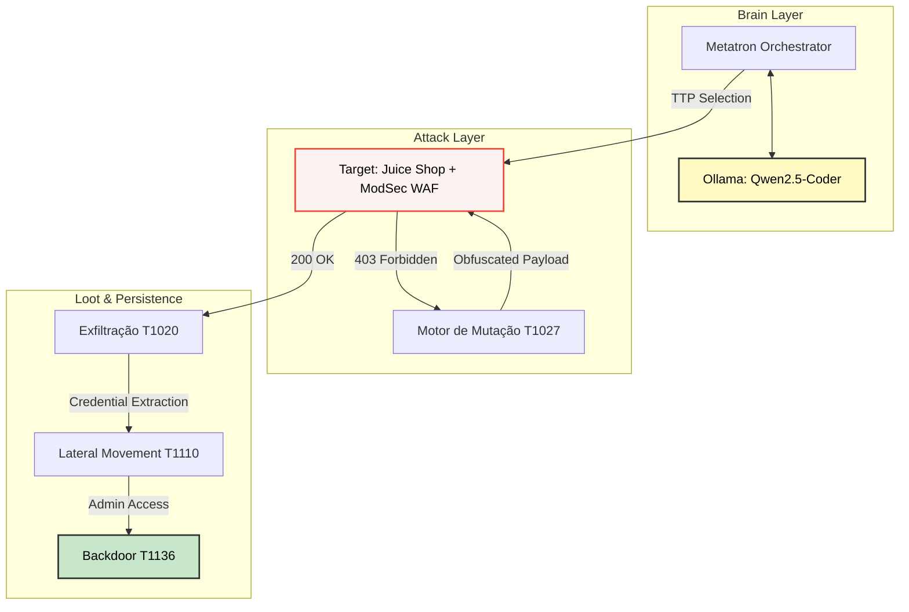

# 🧠 Metatron Lab

> Agente autônomo de **Adversary Emulation** integrado à Inteligência Artificial local para testes de **Defense in Depth**. O sistema automatiza o ciclo de vida completo de uma intrusão, desde o bypass de WAF reativo até a exfiltração e persistência sistêmica.

---

## 📐 Arquitetura de Fluxo de Dados



---

## 🧱 Stack de Arquitetura

| Componente | Função |
|---|---|
| **Ollama (Qwen2.5-Coder)** | Motor cognitivo para seleção de TTPs e mutação de payloads para bypass de WAF |
| **Python 3.10+** | Orquestrador core e motor de análise forense de payloads pós-intrusão |
| **ModSecurity CRS** | Camada de defesa (WAF) alvo para validação de técnicas de evasão e hardening |
| **OWASP Juice Shop** | Ambiente vulnerável de laboratório para testes de exploração controlada |

---

## 🔒 Diretrizes de Segurança — Defense in Depth

- **Vibe Coding Profissional** — Decomposição granular de cada tática da matriz MITRE ATT&CK.
- **Evasão Adaptativa** — Implementação da técnica T1562.001 (WAF Bypass) com feedback loop automático.
- **Persistence Mechanisms** — Criação de contas backdoor via API administrativa para garantir acesso após rotação de credenciais.
- **Zero-Trust Lab** — Todas as ferramentas operam em rede isolada via Docker Compose, sem exposição de ativos externos.

---

## ⚙️ Variáveis de Ambiente e Setup

Configure as chaves de infraestrutura no seu `.env`:

```env
# Endpoints do Lab
TARGET_BASE=http://defense-waf:8080
METATRON_LLM=http://metatron_llm:11434

# Configurações do Brain
MODEL_NAME=qwen2.5-coder:1.5b
MAX_ATTEMPTS=3
```

---

## 🚀 Procedimento de Subida de Ambiente

**1. Orquestração da infra**

```bash
docker-compose up -d
```

**2. Execução do orquestrador de TTPs**

```bash
docker exec -it metatron_brain python3 metatron_ttp.py
```

**3. Movimento lateral e persistência**

```bash
docker exec -it metatron_brain python3 metatron_lateral.py
docker exec -it metatron_brain python3 metatron_persistence.py
```

---

## 📁 Estrutura do Repositório

| Arquivo | Função |
|---|---|
| `metatron_ttp.py` | Orquestrador principal de técnicas MITRE ATT&CK |
| `metatron_lateral.py` | Motor de Credential Stuffing (T1110.004) |
| `metatron_persistence.py` | Módulo de criação de Backdoor e Ghost Accounts |
| `metatron_dump.py` | Script de exfiltração massiva de PII (hashes e e-mails) |
| `system_prompt.txt` | Contexto de especialista (System Prompt) para o LLM |

---

## 🔄 Matriz de Cobertura MITRE ATT&CK

O laboratório valida as seguintes táticas em ambiente controlado:

| ID | Tática | Descrição |
|---|---|---|
| `T1595` | **Reconnaissance** | Path discovery ativo para mapeamento de superfícies |
| `T1190` | **Initial Access** | Exploração de vulnerabilidades em aplicações web expostas |
| `T1027` | **Defense Evasion** | Ofuscação reativa de payloads contra filtros de ModSecurity |
| `T1020` | **Exfiltration** | Mineração automatizada de dados sensíveis pós-sucesso de injeção |

---

## 📌 Procedimento de Push

```bash
# Inicializar o git se necessário
git init
git add .
git commit -m "Feat: metatron lab v2.2 - Full TTP cycle (Bypass, Exfil, Persistence)"

# Configurar o remoto e subir
git remote add origin https://github.com/lordzzed/metatron-lab.git
git branch -M main
git push -u origin main
```

---

> ⚠️ **Nota técnica:** Este projeto é destinado exclusivamente para fins de fortalecimento de ativos e prevenção de incidentes em **ambientes controlados**.
